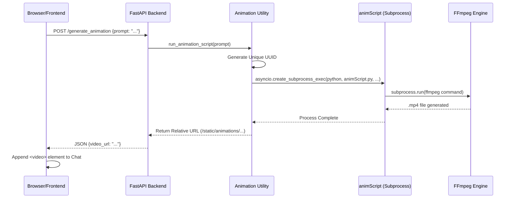

# AluuGPT Animation Pipeline Mechanics

This document provides a technical deep-dive into the AluuGPT animation generation engine, detailing the pipeline from prompt detection to final video rendering.

## 🔄 The Execution Pipeline

The animation process follows a multi-stage asynchronous flow to ensure the main application thread remains responsive while heavy rendering tasks are performed.

## 🛠️ Component Breakdown

### 1. Token Detection (`static/app.js`)
The frontend monitors user input for the `[animation]` token. When detected:
- The token is stripped from the display message but kept for the API request.
- A secondary loading state is triggered specifically for the animation stage.

### 2. Request Orchestration (`main.py`)
The `/generate_animation` endpoint acts as a traffic controller:
- It extracts the prompt and hands it off to the async utility.
- It manages error states, ensuring that if rendering fails, the user is notified without crashing the chat session.

### 3. Environment Preparation (`utils/animation.py`)
Before spawning the rendering process, the utility:
- Configures a headless environment (`SDL_VIDEODRIVER=dummy`).
- Sets up the `PYTHONPATH` to ensure the script has access to internal project modules.
- Generates unique filenames to prevent collision in multi-user environments.

### 4. Rendering Core (`animScript.py`)
This is the specialized execution unit responsible for the visual output:
- **Input Parsing**: Receives the prompt and output destination via CLI arguments.
- **FFmpeg Integration**: Orchestrates the assembly of frames or generation of synthetic visuals.
- **Headless Execution**: Designed to run on servers without a physical display attached.

## 🚀 Performance Considerations

- **Asynchronous Execution**: By using `asyncio.create_subprocess_exec`, the backend can handle multiple concurrent animation requests without blocking.
- **Subprocess Isolation**: Each rendering task runs in its own process space, providing fault tolerance; a crash in the rendering script does not affect the web server.
- **Statics Mounting**: The platform dynamically mounts the output directory, allowing for immediate delivery of the generated file via the web server.

## 📈 Future Enhancements
- **Stage 2 Rendering**: Integration of Manim or Pygame for complex programmatic visuals.
- **Fallback Logic**: Automatic fallback to simpler rendering styles if high-complexity engines are unavailable.
- **Dynamic Framerates**: Adjusting FPS based on prompt complexity to optimize generation speed.
